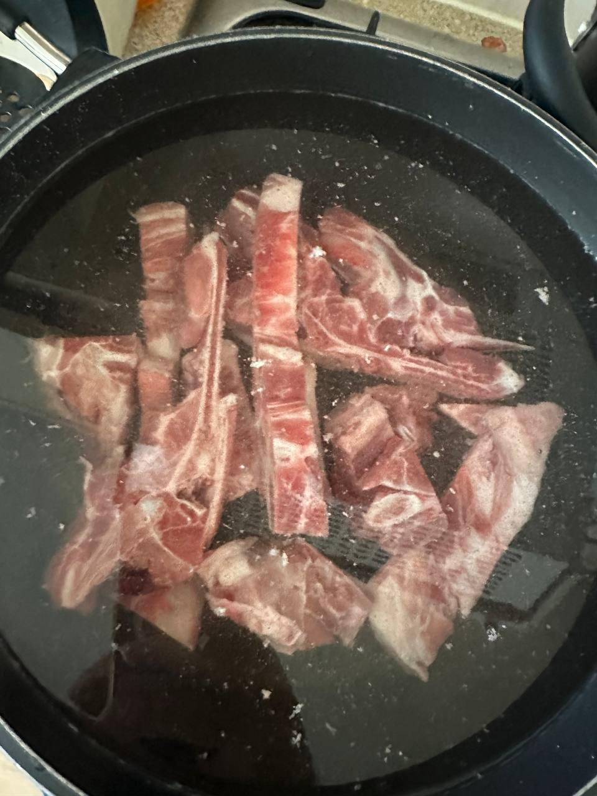
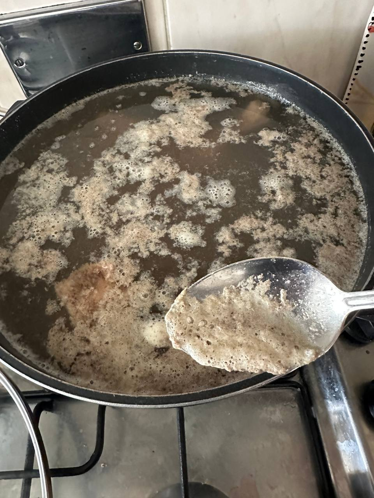
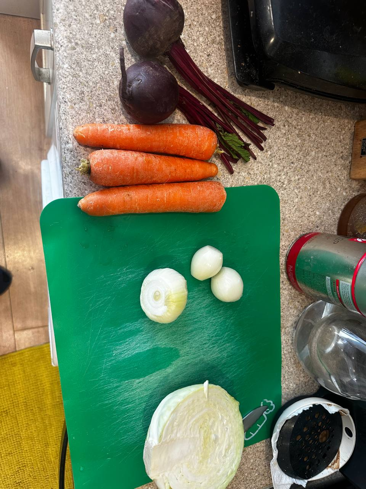
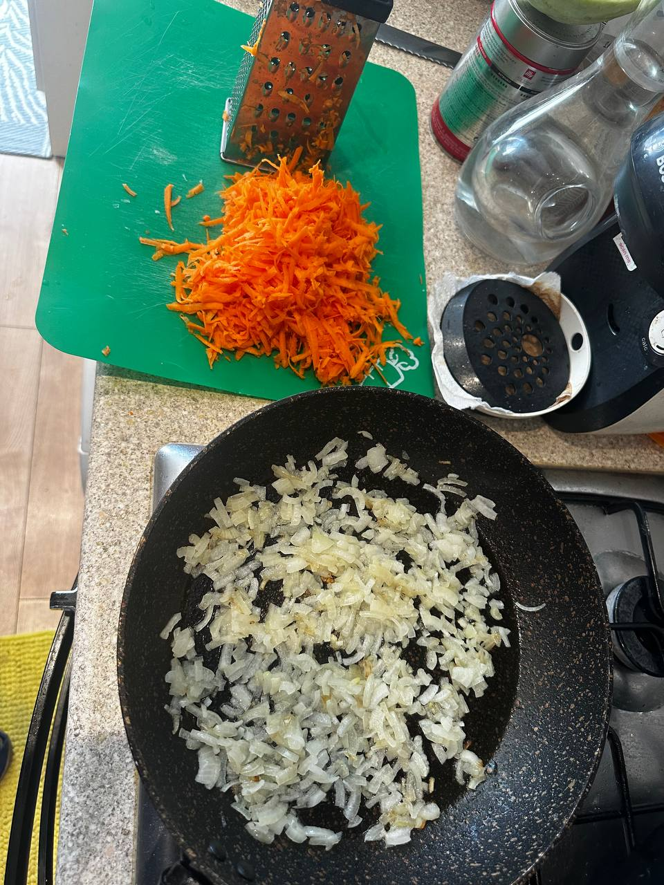
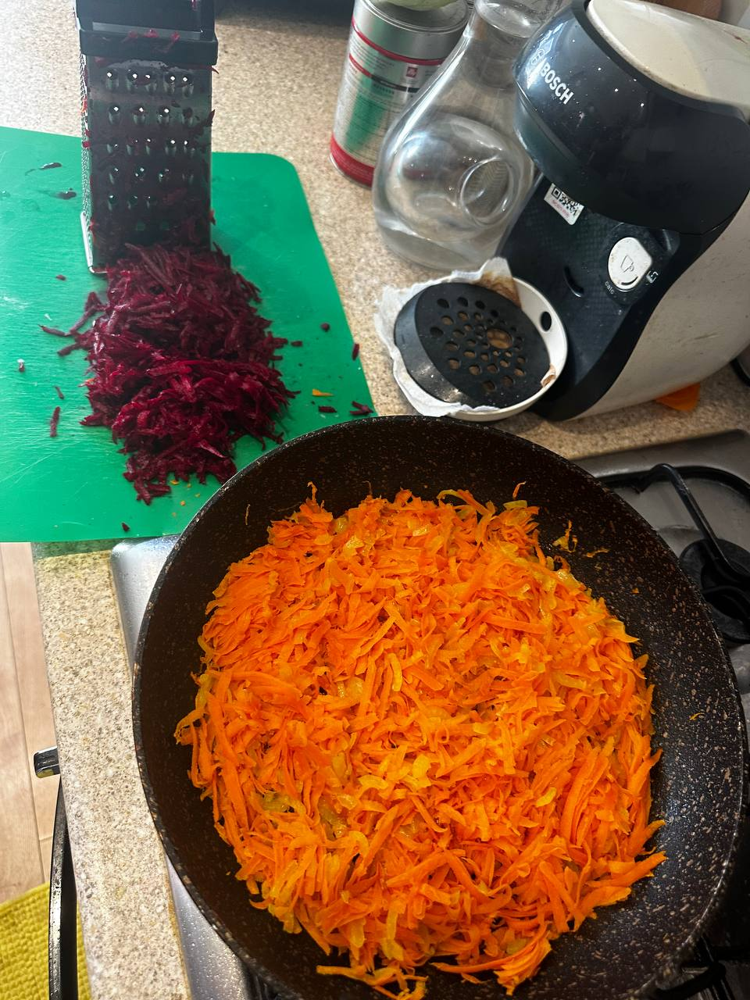
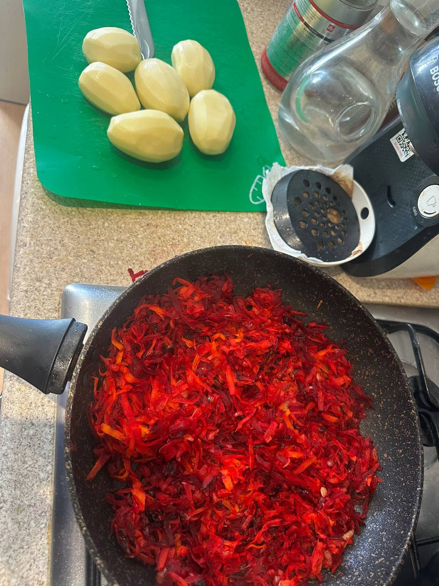
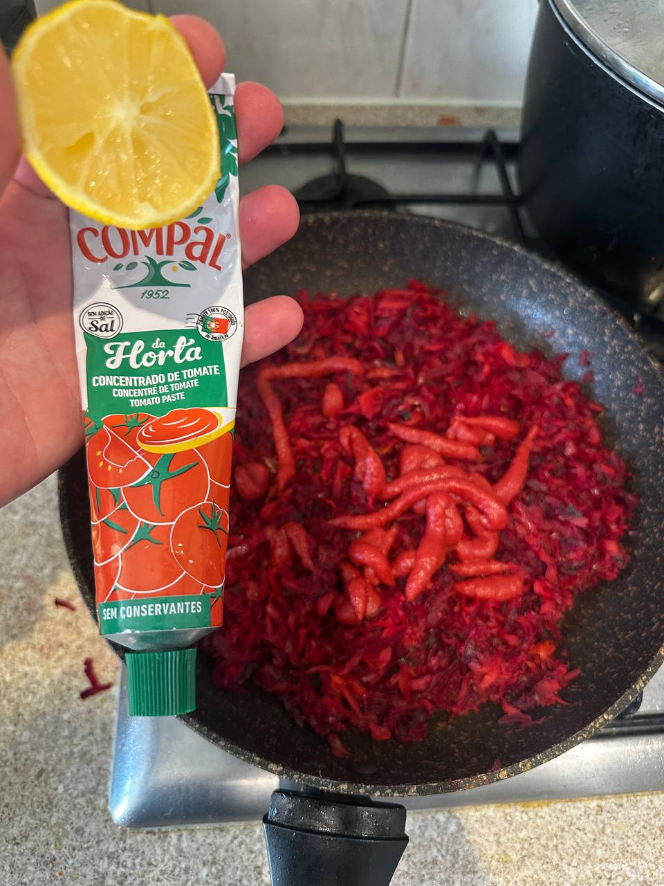
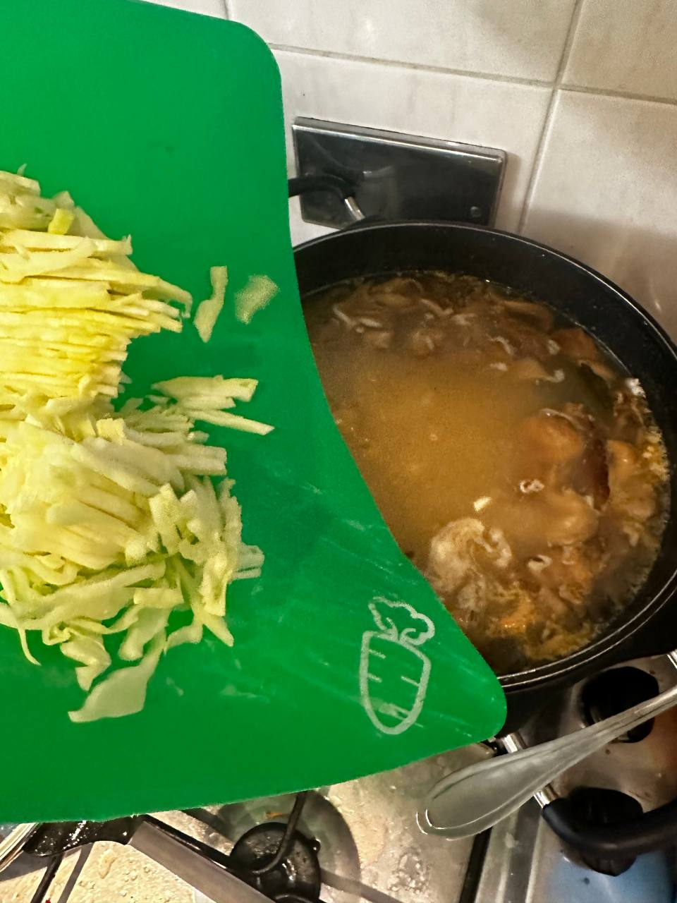
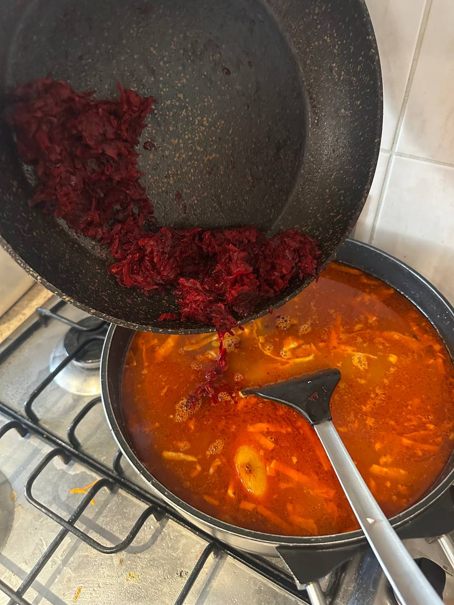
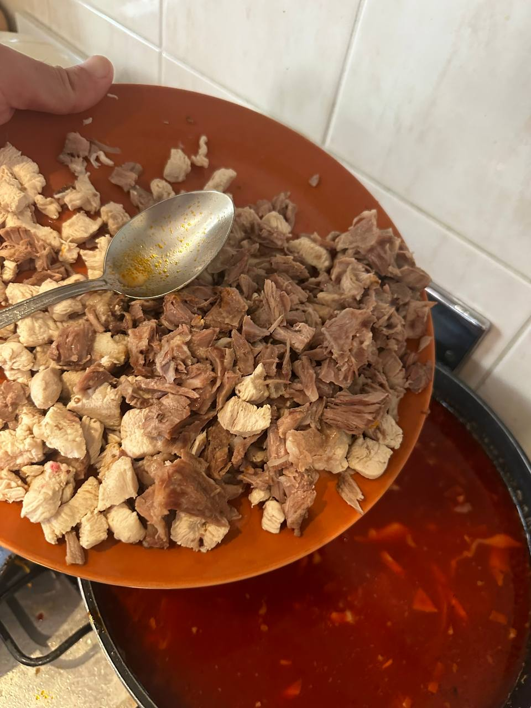

# Кубанский Борщ =)
My cooking routine for a 5 liters bowl

## You will need:
   - (about 1kg or less) Bones or meat for the bouillon (i prefer beef, pork, chicken or lamb. listed in order of preference). Bones with a bit of meat on them are the best. The best beef bones are in Morrison's =)
   - (half of small/medium) White cabbage (other colors may be used, but it may result in another taste)
   - (2-3) Onions 
   - (2-3 medium size) Carrots
   - (2-3 medium size) Beetroot
   - (half of a tube) Tomato paste or something similar
   - (5-6 medium size) Potatoes
   - any oil or fat to fry vegetables. I use about 5 tablespoons of sunflower oil.
   - a boiling pan (2-5 liters)
   - a frying pan (I'm using the largest available, 20-30cm in diameter)
   - bay leaf, whole black pepper and ground black pepper are optional

## Bouillon
1. Rinse the bones lightly. If you're using meat without bones cut it into pieces of edible size. Add water (5 liters in my case) and bring to a boil.  

2. After 5-10 minutes of boiling a gray foam usually appears. It's normal and others don't care, but I spend 5 minutes removing it with a spoon. After doing this, put the spoon somewhere aside. You will need it later.  

3. Add bay leaf (5-7 leaves) and whole pepper (5-10 seeds). I don't feel their taste at the end to be honest, but this is a kind of tradition. Reduce heat to minimum, cover and let it boil. If there is meat only, then 1-2 hours is enough. With bones, you may boil for 3-7 hours to get the best taste (All that time counts toward cooking time! Despite you may go another room and do some fun (let's say math or something similar)=)
4. Do not switch off the heat. It should be kept on until it is ready.

At this stage it could be worthwhile to eat something as well. It is still a long way until borsch is ready.

## Sautéed vegetable base (Zazharka)
1. You will spend another 0.75-2.5 hours to prepare it depending on your skills. Double check you have all vegetables and tomato paste.  

2. Finely cut the onion and start to fry it (heat the frying pan, add oil, and after 1 minute add onion). Usually I am balancing between high/medium heat (high at the moment when I am adding the next vegetable and mixing, then reduce to medium). Meanwhile, peel the carrots and cut them into 2-3mm thick 3-5cm long strips (I am lazy and just use the grater, but it is not traditional as far as I remember =). Do not forget to mix the onion! It may burn (just remove black bits from the frying pan in case of this)  

3. Stir in the carrot. Peel and grate or cut the beetroot in the same way as the carrot. Spread your attention wisely between beetroot and the burning onion&carrot 

4. Stir in the beetroot and fry it for about 10|15|20|30 minutes (if vegetables are cut, and you're following the traditional approach then it takes longer, but in general 10-15 minutes is enough) till it becomes tender. Stir occasionally to prevent burning. Reduce heat if not done yet=). You may add some water if it's too dry. After this, add salt (1 teaspoon) and pepper (half a teaspoon or more if you wish it to be hot). Meanwhile, you are peeling potatoes.  

5. Stir in tomato paste. You may experiment with other spices at this point by adding them to the stir-fry vegetables. I usually add half a lemon, squeezing the juice and mixing in the peel (without cutting it, just a whole piece). 

6. Almost done with the vegetable base. Just keep it frying on low heat while you are doing the rest. Stir occasionally to avoid burning. Switch off the heat anytime if you are too tired of this frying pan. Don't worry too much. If you have come to that point, I am already proud of you! =0))

## Few more steps 
1. If you used bones for the bouillon take them off on the large plate. They need to cooldown so that you will be able to separate bones and meat.
2. Cut the potatoes into cubes/cuboids/spheroids or any other shape that will fit a spoon and mouth. Put them into the boiling bouillon. Increase the heat to maximum and bring it to a boil. Reduce the heat. Potatoes will need about 15-30 minutes to become soft, but still keep the shape (time depends on size of pieces and variety of potatoes, so it's a bit unpredictable, but you will feel it by the call of your Kuban blood)  

3. Cut the cabbage. I am tending to cut finely and avoid long pieces (2-7cm long are good enough). Separate meat from bones. Bones are not needed any more =)
4. With the spoon that you used 5-7 hours ago to remove the foam, try to catch an average representative of a potato piece. It is hot, so let it cool for about 32 seconds and taste it. If it is already soft enough or at the edge of this then add the cabbage quickly! Actually in my opinion cabbage may be added just after potatoes, but it would be too simple.   (on the photo you may notice that I added mushrooms at that stage. It is not within traditional approach)  

5. Bring to a boil playing with low->high->low heat. Then mix in the vegetable base from the frying pan. You don't need frying pan anymore. Mix it slowly to spread the zazharka over the volume. Try not to mash the potato.   (the colour on the photo is already red because I mixed in some chinese tomato soup mixture. It was an experiment=) 

6. Add the meat. Stir gently.  

7. The last important step. Most likely it is not salted enough. Try to taste the liquid. Is it good as a final taste? You may add salt if needed. Extra pepper, salt or other spices may be added now or later during the serving to give the option to personalize the amount.
8. Turn the heat off.
9. Serve with Sour cream/Crème fraîche and bread =)

### Keep an eye on the development of domestic robotic manipulators. We need to automate this %)

