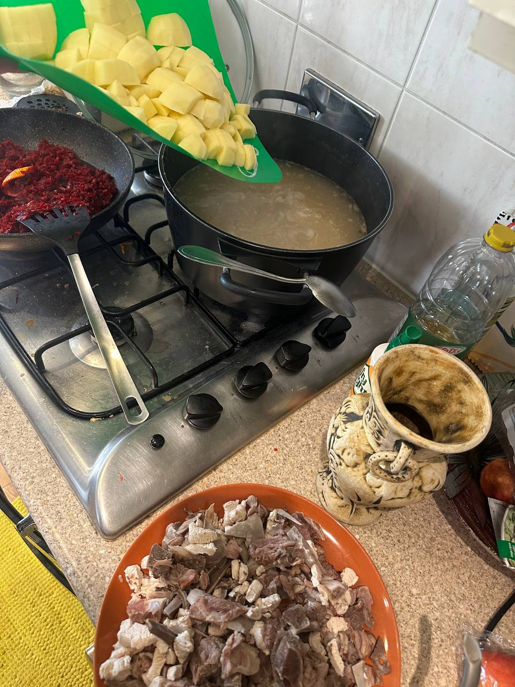

# Кубанский Борщ =)
My cooking routine for 5l bowl

## You will need:
   - (about 1kg or less) Bones or meat for the bouillon (i prefer beef, pork, chicken or lamb listed in order of preference). Bones with a bit of meat on it is the best
   - (half of small/medium) White cabbage (other colours may be used, but it may be another taste)
   - (2-3) Onions 
   - (2-3 medium size) Carrots
   - (2-3 medium size) Beetroot
   - (half of tube) Tomato paste or something similar
   - (5-6 medium size) Potatoes

## Bouillon
1. Rinse lightly the bones. If you was

